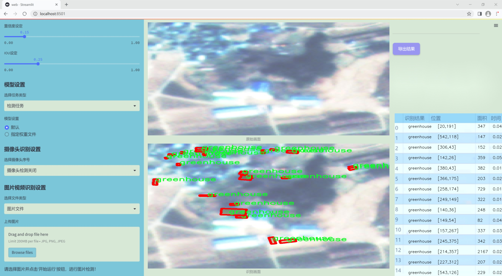
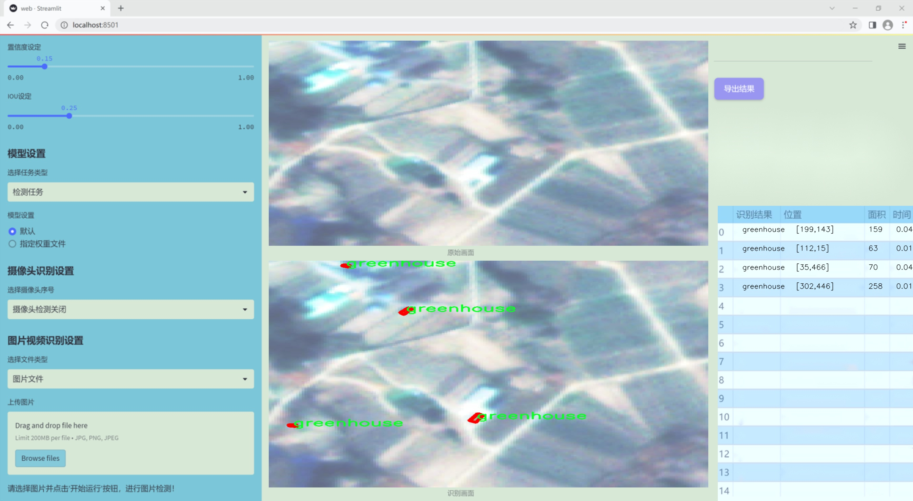
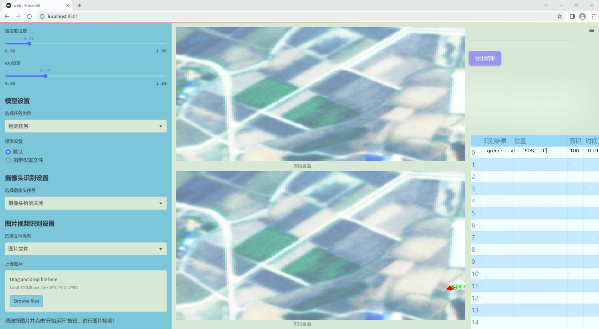
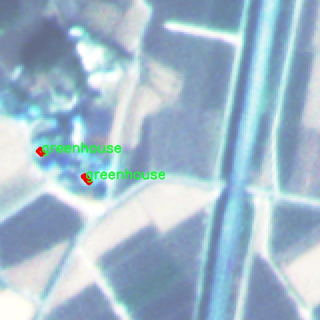
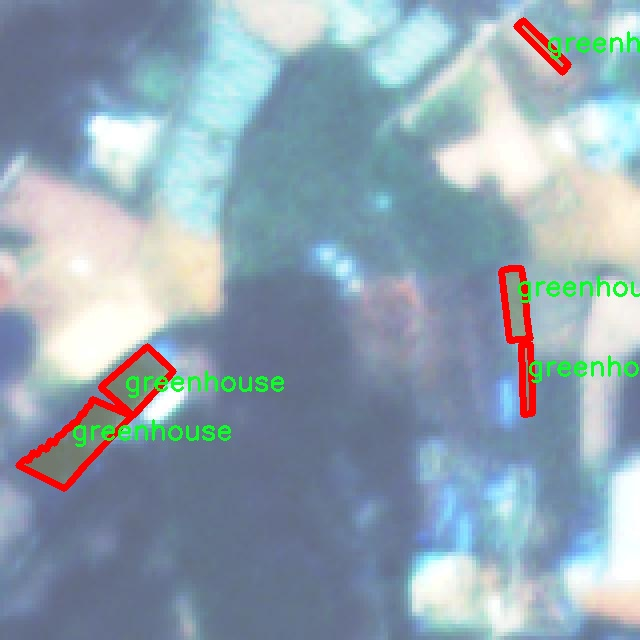
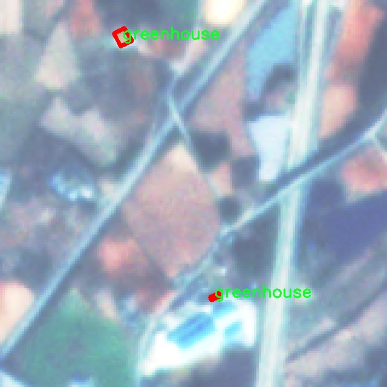
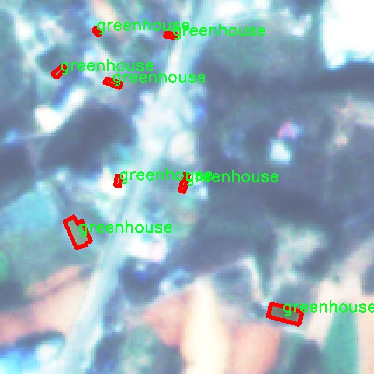

### 1.背景意义

研究背景与意义

随着全球气候变化和人口增长的加剧，温室农业作为一种高效的农业生产方式，逐渐受到重视。温室能够提供一个可控的生长环境，优化作物的生长条件，提高产量和质量。然而，传统的温室管理依赖于人工监测和管理，效率低下且容易出现误差。因此，利用先进的计算机视觉技术对温室进行智能化管理，成为了当前农业科技研究的重要方向。

在这一背景下，遥感技术的应用为温室的监测和管理提供了新的可能性。通过遥感图像获取温室的实时数据，结合图像处理和深度学习技术，可以实现对温室内作物生长状态的自动化分析和监测。尤其是实例分割技术，可以精确地识别和分离出温室内的作物，进而为后续的生长分析、病虫害监测和产量预测提供数据支持。

本研究基于改进的YOLOv11模型，构建一个高效的遥感图温室实例分割系统。该系统利用3900张标注为“温室”的图像数据集，能够实现对温室内作物的精确分割与识别。通过对YOLOv11模型的改进，提升其在实例分割任务中的表现，能够有效应对温室环境中的复杂背景和光照变化，提高分割精度和实时性。

此外，本研究的成果不仅可以为温室农业的智能化管理提供技术支持，还可以为相关领域的研究提供借鉴。通过对温室实例分割的深入研究，推动计算机视觉技术在农业中的应用，助力实现农业生产的数字化和智能化转型，从而提升农业生产效率，保障粮食安全，促进可持续发展。

### 2.视频效果

[2.1 视频效果](https://www.bilibili.com/video/BV15CqzYqEFZ/)

### 3.图片效果







##### [项目涉及的源码数据来源链接](https://kdocs.cn/l/cszuIiCKVNis)**

注意：本项目提供训练的数据集和训练教程,由于版本持续更新,暂不提供权重文件（best.pt）,请按照6.训练教程进行训练后实现上图演示的效果。

### 4.数据集信息

##### 4.1 本项目数据集类别数＆类别名

nc: 1
names: ['greenhouse']


该项目为【图像分割】数据集，请在【训练教程和Web端加载模型教程（第三步）】这一步的时候按照【图像分割】部分的教程来训练

##### 4.2 本项目数据集信息介绍

本项目数据集信息介绍

本项目所使用的数据集以“detectron160”为主题，专门针对遥感图像中的温室实例分割任务进行设计和构建。该数据集的主要目标是为改进YOLOv11模型提供高质量的训练数据，确保其在温室检测和分割方面的性能得到显著提升。数据集中包含的类别数量为1，具体类别为“greenhouse”，这意味着所有的标注和数据均围绕温室这一特定对象展开。通过集中于单一类别，数据集能够提供更为精确和深入的特征学习，进而提升模型在特定场景下的识别能力。

在数据集的构建过程中，研究团队采用了多种遥感图像采集技术，确保数据的多样性和代表性。这些图像涵盖了不同的地理区域、气候条件以及不同生长阶段的温室，力求反映出真实世界中温室的多样性和复杂性。此外，数据集中的图像经过精细的标注，确保每个温室实例都被准确地框定和分割，从而为模型的训练提供了可靠的监督信号。

在数据预处理阶段，团队还对图像进行了标准化处理，以适应YOLOv11模型的输入要求。数据集的规模和质量将直接影响模型的训练效果，因此在数据集的选择和构建上，团队注重数据的完整性和准确性，力求为后续的模型训练和评估提供坚实的基础。通过使用“detectron160”数据集，本项目旨在实现对遥感图像中温室的高效检测与分割，为农业监测和管理提供更为智能化的解决方案。










### 5.全套项目环境部署视频教程（零基础手把手教学）

[5.1 所需软件PyCharm和Anaconda安装教程（第一步）](https://www.bilibili.com/video/BV1BoC1YCEKi/?spm_id_from=333.999.0.0&vd_source=bc9aec86d164b67a7004b996143742dc)


[5.2 安装Python虚拟环境创建和依赖库安装视频教程（第二步）](https://www.bilibili.com/video/BV1ZoC1YCEBw?spm_id_from=333.788.videopod.sections&vd_source=bc9aec86d164b67a7004b996143742dc)

### 6.改进YOLOv11训练教程和Web_UI前端加载模型教程（零基础手把手教学）

[6.1 改进YOLOv11训练教程和Web_UI前端加载模型教程（第三步）](https://www.bilibili.com/video/BV1BoC1YCEhR?spm_id_from=333.788.videopod.sections&vd_source=bc9aec86d164b67a7004b996143742dc)


按照上面的训练视频教程链接加载项目提供的数据集，运行train.py即可开始训练



     Epoch   gpu_mem       box       obj       cls    labels  img_size
     1/200     20.8G   0.01576   0.01955  0.007536        22      1280: 100%|██████████| 849/849 [14:42<00:00,  1.04s/it]
               Class     Images     Labels          P          R     mAP@.5 mAP@.5:.95: 100%|██████████| 213/213 [01:14<00:00,  2.87it/s]
                 all       3395      17314      0.994      0.957      0.0957      0.0843

     Epoch   gpu_mem       box       obj       cls    labels  img_size
     2/200     20.8G   0.01578   0.01923  0.007006        22      1280: 100%|██████████| 849/849 [14:44<00:00,  1.04s/it]
               Class     Images     Labels          P          R     mAP@.5 mAP@.5:.95: 100%|██████████| 213/213 [01:12<00:00,  2.95it/s]
                 all       3395      17314      0.996      0.956      0.0957      0.0845

     Epoch   gpu_mem       box       obj       cls    labels  img_size
     3/200     20.8G   0.01561    0.0191  0.006895        27      1280: 100%|██████████| 849/849 [10:56<00:00,  1.29it/s]
               Class     Images     Labels          P          R     mAP@.5 mAP@.5:.95: 100%|███████   | 187/213 [00:52<00:00,  4.04it/s]
                 all       3395      17314      0.996      0.957      0.0957      0.0845


###### [项目数据集下载链接](https://kdocs.cn/l/cszuIiCKVNis)

### 7.原始YOLOv11算法讲解


##### YOLO11介绍

Ultralytics YOLO11是一款尖端的、最先进的模型，它在之前YOLO版本成功的基础上进行了构建，并引入了新功能和改进，以进一步提升性能和灵活性。
**YOLO11设计快速、准确且易于使用，使其成为各种物体检测和跟踪、实例分割、图像分类以及姿态估计任务的绝佳选择。**


**结构图如下：**


##### **C3k2**

**C3k2，结构图如下**


**C3k2，继承自类`C2f，其中通过c3k设置False或者Ture来决定选择使用C3k还是`**Bottleneck


**实现代码** **ultralytics/nn/modules/block.py**

##### C2PSA介绍

**借鉴V10 PSA结构，实现了C2PSA和C2fPSA，最终选择了基于C2的C2PSA（可能涨点更好？）**


**实现代码** **ultralytics/nn/modules/block.py**

##### Detect介绍

**分类检测头引入了DWConv（更加轻量级，为后续二次创新提供了改进点），结构图如下（和V8的区别）：**


### 8.200+种全套改进YOLOV11创新点原理讲解

#### 8.1 200+种全套改进YOLOV11创新点原理讲解大全

由于篇幅限制，每个创新点的具体原理讲解就不全部展开，具体见下列网址中的改进模块对应项目的技术原理博客网址【Blog】（创新点均为模块化搭建，原理适配YOLOv5~YOLOv11等各种版本）

[改进模块技术原理博客【Blog】网址链接](https://gitee.com/qunmasj/good)


#### 8.2 精选部分改进YOLOV11创新点原理讲解

###### 这里节选部分改进创新点展开原理讲解(完整的改进原理见上图和[改进模块技术原理博客链接](https://gitee.com/qunmasj/good)【如果此小节的图加载失败可以通过CSDN或者Github搜索该博客的标题访问原始博客，原始博客图片显示正常】
### FasterNet简介
神经网络在图像分类、检测和分割等各种计算机视觉任务中经历了快速发展。尽管其令人印象深刻的性能为许多应用程序提供了动力，但一个巨大的趋势是追求具有低延迟和高吞吐量的快速神经网络，以获得良好的用户体验、即时响应和安全原因等。

如何快速？研究人员和从业者不需要更昂贵的计算设备，而是倾向于设计具有成本效益的快速神经网络，降低计算复杂度，主要以浮点运算（FLOPs）的数量来衡量。

MobileNet、ShuffleNet和GhostNet等利用深度卷积（DWConv）和/或组卷积（GConv）来提取空间特征。然而，在减少FLOPs的过程中，算子经常会受到内存访问增加的副作用的影响。MicroNet进一步分解和稀疏网络，将其FLOPs推至极低水平。尽管这种方法在FLOPs方面有所改进，但其碎片计算效率很低。此外，上述网络通常伴随着额外的数据操作，如级联、Shuffle和池化，这些操作的运行时间对于小型模型来说往往很重要。

除了上述纯卷积神经网络（CNNs）之外，人们对使视觉Transformer（ViTs）和多层感知器（MLP）架构更小更快也越来越感兴趣。例如，MobileViT和MobileFormer通过将DWConv与改进的注意力机制相结合，降低了计算复杂性。然而，它们仍然受到DWConv的上述问题的困扰，并且还需要修改的注意力机制的专用硬件支持。使用先进但耗时的标准化和激活层也可能限制其在设备上的速度。

所有这些问题一起导致了以下问题：这些“快速”的神经网络真的很快吗？为了回答这个问题，作者检查了延迟和FLOPs之间的关系，这由


其中FLOPS是每秒浮点运算的缩写，作为有效计算速度的度量。虽然有许多减少FLOPs的尝试，但都很少考虑同时优化FLOPs以实现真正的低延迟。为了更好地理解这种情况，作者比较了Intel CPU上典型神经网络的FLOPS。


图中的结果表明，许多现有神经网络的FLOPS较低，其FLOPS通常低于流行的ResNet50。由于FLOPS如此之低，这些“快速”的神经网络实际上不够快。它们的FLOPs减少不能转化为延迟的确切减少量。在某些情况下，没有任何改善，甚至会导致更糟的延迟。例如，CycleMLP-B1具有ResNet50的一半FLOPs，但运行速度较慢（即CycleMLPB1与ResNet50:111.9ms与69.4ms）。

请注意，FLOPs与延迟之间的差异在之前的工作中也已被注意到，但由于它们采用了DWConv/GConv和具有低FLOPs的各种数据处理，因此部分问题仍未解决。人们认为没有更好的选择。

该博客提供的方案通过开发一种简单、快速、有效的运算符来消除这种差异，该运算符可以在减少FLOPs的情况下保持高FLOPS。

具体来说，作者重新审视了现有的操作符，特别是DWConv的计算速度——FLOPS。作者发现导致低FLOPS问题的主要原因是频繁的内存访问。然后，作者提出了PConv作为一种竞争性替代方案，它减少了计算冗余以及内存访问的数量。

图1说明了PConv的设计。它利用了特征图中的冗余，并系统地仅在一部分输入通道上应用规则卷积（Conv），而不影响其余通道。本质上，PConv的FLOPs低于常规Conv，而FLOPs高于DWConv/GConv。换句话说，PConv更好地利用了设备上的计算能力。PConv在提取空间特征方面也很有效，这在本文后面的实验中得到了验证。

作者进一步引入PConv设计了FasterNet作为一个在各种设备上运行速度非常快的新网络家族。特别是，FasterNet在分类、检测和分割任务方面实现了最先进的性能，同时具有更低的延迟和更高的吞吐量。例如，在GPU、CPU和ARM处理器上，小模型FasterNet-T0分别比MobileVitXXS快3.1倍、3.1倍和2.5倍，而在ImageNet-1k上的准确率高2.9%。大模型FasterNet-L实现了83.5%的Top-1精度，与Swin-B不相上下，同时在GPU上提供了49%的高吞吐量，在CPU上节省了42%的计算时间。

总之，贡献如下：

指出了实现更高FLOPS的重要性，而不仅仅是为了更快的神经网络而减少FLOPs。

引入了一种简单但快速且有效的卷积PConv，它很有可能取代现有的选择DWConv。

推出FasterNet，它在GPU、CPU和ARM处理器等多种设备上运行良好且普遍快速。

对各种任务进行了广泛的实验，并验证了PConv和FasterNet的高速性和有效性。

### Conv和FasterNet的设计
#### 原理

DWConv是Conv的一种流行变体，已被广泛用作许多神经网络的关键构建块。对于输入，DWConv应用个滤波器来计算输出。如图（b）所示，每个滤波器在一个输入通道上进行空间滑动，并对一个输出通道做出贡献。

与具有的FLOPs常规Conv相比，这种深度计算使得DWConv仅仅具有的FLOPs。虽然在减少FLOPs方面有效，但DWConv（通常后跟逐点卷积或PWConv）不能简单地用于替换常规Conv，因为它会导致严重的精度下降。因此，在实践中，DWConv的通道数（或网络宽度）增加到＞以补偿精度下降，例如，倒置残差块中的DWConv宽度扩展了6倍。然而，这会导致更高的内存访问，这会造成不可忽略的延迟，并降低总体计算速度，尤其是对于I/O绑定设备。特别是，内存访问的数量现在上升到


它比一个常规的Conv的值要高，即，


注意，内存访问花费在I/O操作上，这被认为已经是最小的成本，很难进一步优化。

#### PConv作为一个基本的算子


在下面演示了通过利用特征图的冗余度可以进一步优化成本。如图所示，特征图在不同通道之间具有高度相似性。许多其他著作也涵盖了这种冗余，但很少有人以简单而有效的方式充分利用它。


具体而言，作者提出了一种简单的PConv，以同时减少计算冗余和内存访问。图4中的左下角说明了PConv的工作原理。它只需在输入通道的一部分上应用常规Conv进行空间特征提取，并保持其余通道不变。对于连续或规则的内存访问，将第一个或最后一个连续的通道视为整个特征图的代表进行计算。在不丧失一般性的情况下认为输入和输出特征图具有相同数量的通道。因此，PConv的FLOPs仅


对于典型的r＝1/4 ，PConv的FLOPs只有常规Conv的1/16。此外，PConv的内存访问量较小，即：


对于r＝1/4，其仅为常规Conv的1/4。

由于只有通道用于空间特征提取，人们可能会问是否可以简单地移除剩余的（c−）通道？如果是这样，PConv将退化为具有较少通道的常规Conv，这偏离了减少冗余的目标。

请注意，保持其余通道不变，而不是从特征图中删除它们。这是因为它们对后续PWConv层有用，PWConv允许特征信息流经所有通道。

#### PConv之后是PWConv


为了充分有效地利用来自所有通道的信息，进一步将逐点卷积（PWConv）附加到PConv。它们在输入特征图上的有效感受野看起来像一个T形Conv，与均匀处理补丁的常规Conv相比，它更专注于中心位置，如图5所示。为了证明这个T形感受野的合理性，首先通过计算位置的Frobenius范数来评估每个位置的重要性。


假设，如果一个职位比其他职位具有更大的Frobenius范数，则该职位往往更重要。对于正则Conv滤波器，位置处的Frobenius范数由计算，其中。


一个显著位置是具有最大Frobenius范数的位置。然后，在预训练的ResNet18中集体检查每个过滤器，找出它们的显著位置，并绘制显著位置的直方图。图6中的结果表明，中心位置是过滤器中最常见的突出位置。换句话说，中心位置的权重比周围的更重。这与集中于中心位置的T形计算一致。

虽然T形卷积可以直接用于高效计算，但作者表明，将T形卷积分解为PConv和PWConv更好，因为该分解利用了滤波器间冗余并进一步节省了FLOPs。对于相同的输入和输出，T形Conv的FLOPs可以计算为:


它高于PConv和PWConv的流量，即：


其中和（例如，当时）。此外，可以很容易地利用常规Conv进行两步实现。

# FasterNet作为Backbone
鉴于新型PConv和现成的PWConv作为主要的算子，进一步提出FasterNet，这是一个新的神经网络家族，运行速度非常快，对许多视觉任务非常有效。目标是使体系结构尽可能简单，使其总体上对硬件友好。


在图中展示了整体架构。它有4个层次级，每个层次级前面都有一个嵌入层（步长为4的常规4×4卷积）或一个合并层（步长为2的常规2×2卷积），用于空间下采样和通道数量扩展。每个阶段都有一堆FasterNet块。作者观察到，最后两个阶段中的块消耗更少的内存访问，并且倾向于具有更高的FLOPS，如表1中的经验验证。因此，放置了更多FasterNet块，并相应地将更多计算分配给最后两个阶段。每个FasterNet块有一个PConv层，后跟2个PWConv（或Conv 1×1）层。它们一起显示为倒置残差块，其中中间层具有扩展的通道数量，并且放置了Shorcut以重用输入特征。

除了上述算子，标准化和激活层对于高性能神经网络也是不可或缺的。然而，许多先前的工作在整个网络中过度使用这些层，这可能会限制特征多样性，从而损害性能。它还可以降低整体计算速度。相比之下，只将它们放在每个中间PWConv之后，以保持特征多样性并实现较低的延迟。

此外，使用批次归一化（BN）代替其他替代方法。BN的优点是，它可以合并到其相邻的Conv层中，以便更快地进行推断，同时与其他层一样有效。对于激活层，根据经验选择了GELU用于较小的FasterNet变体，而ReLU用于较大的FasterNet变体，同时考虑了运行时间和有效性。最后三个层，即全局平均池化、卷积1×1和全连接层，一起用于特征转换和分类。

为了在不同的计算预算下提供广泛的应用，提供FasterNet的Tiny模型、Small模型、Medium模型和Big模型变体，分别称为FasterNetT0/1/2、FasterNet-S、FasterNet-M和FasterNet-L。它们具有相似的结构，但深度和宽度不同。

架构规范如下：


### 9.系统功能展示

图9.1.系统支持检测结果表格显示

  图9.2.系统支持置信度和IOU阈值手动调节

  图9.3.系统支持自定义加载权重文件best.pt(需要你通过步骤5中训练获得)

  图9.4.系统支持摄像头实时识别

  图9.5.系统支持图片识别

  图9.6.系统支持视频识别

  图9.7.系统支持识别结果文件自动保存

  图9.8.系统支持Excel导出检测结果数据


### 10. YOLOv11核心改进源码讲解

#### 10.1 efficientViT.py

以下是对代码的核心部分进行提炼和详细注释的结果：

```python
import torch
import torch.nn as nn
import torch.nn.functional as F
import itertools
from timm.models.layers import SqueezeExcite

# 定义卷积层和批归一化的组合
class Conv2d_BN(torch.nn.Sequential):
    def __init__(self, in_channels, out_channels, kernel_size=1, stride=1, padding=0, dilation=1, groups=1, bn_weight_init=1):
        super().__init__()
        # 添加卷积层
        self.add_module('conv', torch.nn.Conv2d(in_channels, out_channels, kernel_size, stride, padding, dilation, groups, bias=False))
        # 添加批归一化层
        self.add_module('bn', torch.nn.BatchNorm2d(out_channels))
        # 初始化批归一化的权重
        torch.nn.init.constant_(self.bn.weight, bn_weight_init)
        torch.nn.init.constant_(self.bn.bias, 0)

    @torch.no_grad()
    def switch_to_deploy(self):
        # 将训练模式的卷积和批归一化合并为一个卷积层
        conv, bn = self._modules.values()
        w = bn.weight / (bn.running_var + bn.eps)**0.5
        w = conv.weight * w[:, None, None, None]
        b = bn.bias - bn.running_mean * bn.weight / (bn.running_var + bn.eps)**0.5
        m = torch.nn.Conv2d(w.size(1) * conv.groups, w.size(0), w.shape[2:], stride=conv.stride, padding=conv.padding, dilation=conv.dilation, groups=conv.groups)
        m.weight.data.copy_(w)
        m.bias.data.copy_(b)
        return m

# 定义有效的ViT块
class EfficientViTBlock(torch.nn.Module):
    def __init__(self, type, embed_dim, key_dim, num_heads=8, attn_ratio=4, resolution=14, window_resolution=7):
        super().__init__()
        # 深度卷积
        self.dw0 = Residual(Conv2d_BN(embed_dim, embed_dim, 3, 1, 1, groups=embed_dim))
        # 前馈网络
        self.ffn0 = Residual(FFN(embed_dim, int(embed_dim * 2)))
        
        # 根据类型选择混合器
        if type == 's':
            self.mixer = Residual(LocalWindowAttention(embed_dim, key_dim, num_heads, attn_ratio, resolution, window_resolution))

        self.dw1 = Residual(Conv2d_BN(embed_dim, embed_dim, 3, 1, 1, groups=embed_dim))
        self.ffn1 = Residual(FFN(embed_dim, int(embed_dim * 2)))

    def forward(self, x):
        # 前向传播
        return self.ffn1(self.dw1(self.mixer(self.ffn0(self.dw0(x)))))

# 定义EfficientViT模型
class EfficientViT(torch.nn.Module):
    def __init__(self, img_size=400, patch_size=16, in_chans=3, stages=['s', 's', 's'], embed_dim=[64, 128, 192], key_dim=[16, 16, 16], depth=[1, 2, 3], num_heads=[4, 4, 4], window_size=[7, 7, 7]):
        super().__init__()
        # 图像嵌入层
        self.patch_embed = torch.nn.Sequential(
            Conv2d_BN(in_chans, embed_dim[0] // 8, 3, 2, 1),
            torch.nn.ReLU(),
            Conv2d_BN(embed_dim[0] // 8, embed_dim[0] // 4, 3, 2, 1),
            torch.nn.ReLU(),
            Conv2d_BN(embed_dim[0] // 4, embed_dim[0] // 2, 3, 2, 1),
            torch.nn.ReLU(),
            Conv2d_BN(embed_dim[0] // 2, embed_dim[0], 3, 1, 1)
        )

        # 创建多个EfficientViT块
        self.blocks = []
        for i, (stg, ed, kd, dpth, nh) in enumerate(zip(stages, embed_dim, key_dim, depth, num_heads)):
            for d in range(dpth):
                self.blocks.append(EfficientViTBlock(stg, ed, kd, nh, resolution=img_size // patch_size))
        self.blocks = torch.nn.Sequential(*self.blocks)

    def forward(self, x):
        # 前向传播
        x = self.patch_embed(x)
        x = self.blocks(x)
        return x

# 定义模型的不同配置
EfficientViT_m0 = {
    'img_size': 224,
    'patch_size': 16,
    'embed_dim': [64, 128, 192],
    'depth': [1, 2, 3],
    'num_heads': [4, 4, 4],
    'window_size': [7, 7, 7],
}

# 定义模型创建函数
def EfficientViT_M0(pretrained='', frozen_stages=0):
    model = EfficientViT(frozen_stages=frozen_stages, **EfficientViT_m0)
    if pretrained:
        model.load_state_dict(torch.load(pretrained)['model'])
    return model

if __name__ == '__main__':
    model = EfficientViT_M0('efficientvit_m0.pth')
    inputs = torch.randn((1, 3, 640, 640))
    res = model(inputs)
    for i in res:
        print(i.size())
```

### 代码注释说明：
1. **Conv2d_BN**: 这个类将卷积层和批归一化层组合在一起，提供了一个便捷的方式来初始化和使用卷积层。
2. **EfficientViTBlock**: 这个类定义了一个有效的ViT块，包含深度卷积、前馈网络和注意力机制。
3. **EfficientViT**: 这个类是整个模型的实现，负责将输入图像转换为嵌入，并通过多个ViT块进行处理。
4. **模型配置**: 提供了不同的模型配置，以便于创建不同规模的EfficientViT模型。
5. **模型创建函数**: 提供了一个函数来创建模型实例，并加载预训练权重（如果提供）。

通过这些核心部分和注释，读者可以更好地理解EfficientViT模型的结构和功能。

这个文件定义了一个名为 `EfficientViT` 的深度学习模型架构，主要用于图像处理任务。该模型的设计灵感来源于视觉Transformer（ViT），并结合了一些高效的卷积操作和注意力机制，以提高性能和效率。

首先，文件导入了必要的库，包括 PyTorch 和一些特定的模块。接着，定义了一些基本的构建块，例如 `Conv2d_BN` 类，它是一个包含卷积层和批归一化层的组合。这个类在初始化时会创建一个卷积层和一个批归一化层，并对批归一化的权重进行初始化。

`replace_batchnorm` 函数用于替换模型中的批归一化层为恒等映射，以便在推理时提高效率。接下来，定义了 `PatchMerging` 类，它用于将输入特征图的多个小块合并为更大的块，以减少特征图的分辨率并增加通道数。

`Residual` 类实现了残差连接的功能，可以在训练过程中随机丢弃部分输入，以增强模型的鲁棒性。`FFN` 类实现了前馈神经网络，包含两个卷积层和一个激活函数。

`CascadedGroupAttention` 和 `LocalWindowAttention` 类实现了不同类型的注意力机制。前者是级联组注意力，后者是局部窗口注意力。它们都通过计算查询、键和值之间的关系来捕捉特征之间的依赖关系。

`EfficientViTBlock` 类是模型的基本构建块，包含多个卷积层、前馈网络和注意力机制。`EfficientViT` 类则是整个模型的核心，负责构建模型的不同阶段，包括特征提取和特征融合。

在模型的初始化过程中，定义了多个超参数，例如图像大小、补丁大小、嵌入维度、深度等，并根据这些参数构建模型的不同层。模型的前向传播方法将输入数据依次通过各个层，并在每个阶段收集输出。

最后，文件中定义了一些不同配置的模型实例（如 `EfficientViT_m0` 到 `EfficientViT_m5`），并提供了加载预训练权重和替换批归一化的功能。`update_weight` 函数用于更新模型的权重字典，确保模型的权重与预训练权重匹配。

在 `__main__` 部分，代码展示了如何实例化模型并进行一次前向传播，打印出每个输出的尺寸。这段代码可以用来验证模型的结构和功能是否正常。

#### 10.2 SwinTransformer.py

以下是代码中最核心的部分，并附上详细的中文注释：

```python
import torch
import torch.nn as nn
import torch.nn.functional as F
import numpy as np

class Mlp(nn.Module):
    """ 多层感知机 (MLP) 模块。"""

    def __init__(self, in_features, hidden_features=None, out_features=None, act_layer=nn.GELU, drop=0.):
        super().__init__()
        out_features = out_features or in_features  # 输出特征数，如果未指定则与输入特征数相同
        hidden_features = hidden_features or in_features  # 隐藏层特征数，如果未指定则与输入特征数相同
        self.fc1 = nn.Linear(in_features, hidden_features)  # 第一层线性变换
        self.act = act_layer()  # 激活函数
        self.fc2 = nn.Linear(hidden_features, out_features)  # 第二层线性变换
        self.drop = nn.Dropout(drop)  # Dropout层

    def forward(self, x):
        """ 前向传播函数。"""
        x = self.fc1(x)  # 线性变换
        x = self.act(x)  # 激活
        x = self.drop(x)  # Dropout
        x = self.fc2(x)  # 线性变换
        x = self.drop(x)  # Dropout
        return x

class WindowAttention(nn.Module):
    """ 基于窗口的多头自注意力 (W-MSA) 模块。"""

    def __init__(self, dim, window_size, num_heads, qkv_bias=True, attn_drop=0., proj_drop=0.):
        super().__init__()
        self.dim = dim  # 输入通道数
        self.window_size = window_size  # 窗口大小
        self.num_heads = num_heads  # 注意力头数
        head_dim = dim // num_heads  # 每个头的维度
        self.scale = head_dim ** -0.5  # 缩放因子

        # 定义相对位置偏置参数表
        self.relative_position_bias_table = nn.Parameter(
            torch.zeros((2 * window_size[0] - 1) * (2 * window_size[1] - 1), num_heads))  # 位置偏置表

        # 计算每个token的相对位置索引
        coords_h = torch.arange(self.window_size[0])
        coords_w = torch.arange(self.window_size[1])
        coords = torch.stack(torch.meshgrid([coords_h, coords_w]))  # 生成坐标网格
        coords_flatten = torch.flatten(coords, 1)  # 展平坐标
        relative_coords = coords_flatten[:, :, None] - coords_flatten[:, None, :]  # 计算相对坐标
        relative_coords = relative_coords.permute(1, 2, 0).contiguous()  # 调整维度
        relative_coords[:, :, 0] += self.window_size[0] - 1  # 位置偏置调整
        relative_coords[:, :, 1] += self.window_size[1] - 1
        relative_coords[:, :, 0] *= 2 * self.window_size[1] - 1
        relative_position_index = relative_coords.sum(-1)  # 计算相对位置索引
        self.register_buffer("relative_position_index", relative_position_index)  # 注册为缓冲区

        self.qkv = nn.Linear(dim, dim * 3, bias=qkv_bias)  # 线性变换用于生成Q, K, V
        self.attn_drop = nn.Dropout(attn_drop)  # 注意力权重的Dropout
        self.proj = nn.Linear(dim, dim)  # 输出线性变换
        self.proj_drop = nn.Dropout(proj_drop)  # 输出的Dropout
        self.softmax = nn.Softmax(dim=-1)  # Softmax层

    def forward(self, x, mask=None):
        """ 前向传播函数。"""
        B_, N, C = x.shape  # B_: 批量大小, N: token数量, C: 通道数
        qkv = self.qkv(x).reshape(B_, N, 3, self.num_heads, C // self.num_heads).permute(2, 0, 3, 1, 4)  # 计算Q, K, V
        q, k, v = qkv[0], qkv[1], qkv[2]  # 分离Q, K, V

        q = q * self.scale  # 缩放Q
        attn = (q @ k.transpose(-2, -1))  # 计算注意力分数

        # 添加相对位置偏置
        relative_position_bias = self.relative_position_bias_table[self.relative_position_index.view(-1)].view(
            self.window_size[0] * self.window_size[1], self.window_size[0] * self.window_size[1], -1)  # 计算相对位置偏置
        relative_position_bias = relative_position_bias.permute(2, 0, 1).contiguous()  # 调整维度
        attn = attn + relative_position_bias.unsqueeze(0)  # 添加偏置

        attn = self.softmax(attn)  # 计算注意力权重
        attn = self.attn_drop(attn)  # Dropout

        x = (attn @ v).transpose(1, 2).reshape(B_, N, C)  # 计算输出
        x = self.proj(x)  # 线性变换
        x = self.proj_drop(x)  # Dropout
        return x

class SwinTransformer(nn.Module):
    """ Swin Transformer 主体。"""

    def __init__(self, pretrain_img_size=224, patch_size=4, in_chans=3, embed_dim=96, depths=[2, 2, 6, 2], num_heads=[3, 6, 12, 24], window_size=7, mlp_ratio=4., drop_rate=0., attn_drop_rate=0., drop_path_rate=0.2, norm_layer=nn.LayerNorm):
        super().__init__()

        self.patch_embed = PatchEmbed(patch_size=patch_size, in_chans=in_chans, embed_dim=embed_dim)  # 图像分块嵌入
        self.pos_drop = nn.Dropout(p=drop_rate)  # Dropout层

        # 构建层
        self.layers = nn.ModuleList()
        for i_layer in range(len(depths)):
            layer = BasicLayer(
                dim=int(embed_dim * 2 ** i_layer),
                depth=depths[i_layer],
                num_heads=num_heads[i_layer],
                window_size=window_size,
                mlp_ratio=mlp_ratio,
                drop=drop_rate,
                attn_drop=attn_drop_rate,
                norm_layer=norm_layer)
            self.layers.append(layer)

    def forward(self, x):
        """ 前向传播函数。"""
        x = self.patch_embed(x)  # 图像分块嵌入
        x = self.pos_drop(x)  # Dropout

        for layer in self.layers:
            x_out, _, _, x, _, _ = layer(x)  # 逐层前向传播

        return x_out  # 返回最后一层的输出
```

### 主要部分解释：
1. **Mlp类**：实现了一个简单的多层感知机，包含两层线性变换和激活函数。
2. **WindowAttention类**：实现了窗口基础的多头自注意力机制，计算输入特征的注意力分数，并考虑相对位置偏置。
3. **SwinTransformer类**：构建了Swin Transformer的主体结构，包括图像分块嵌入和多个Transformer层的堆叠。

该程序文件实现了Swin Transformer模型，这是一个用于计算机视觉任务的深度学习模型。Swin Transformer的核心思想是通过局部窗口注意力机制来处理图像数据，从而有效地捕捉图像中的上下文信息。

首先，文件导入了必要的库，包括PyTorch及其相关模块。接着定义了一个多层感知机（Mlp）类，用于构建全连接层和激活函数，包含前向传播方法。

接下来，定义了两个函数`window_partition`和`window_reverse`，分别用于将输入特征图划分为窗口和将窗口合并回特征图。这种窗口划分的方式使得模型能够在局部区域内进行自注意力计算。

然后，定义了`WindowAttention`类，它实现了基于窗口的多头自注意力机制。该类的构造函数中初始化了输入通道数、窗口大小、注意力头数等参数，并计算了相对位置偏置。前向传播方法中，输入特征经过线性变换得到查询、键、值，并计算注意力权重，最后通过加权求和得到输出。

`SwinTransformerBlock`类实现了Swin Transformer的基本模块，包含规范化层、窗口注意力层和多层感知机。该模块支持循环移位操作，以实现跨窗口的信息交流。

`PatchMerging`类用于将特征图的补丁合并，以降低特征图的分辨率。它通过线性变换将四个补丁合并为一个新的补丁，并进行规范化。

`BasicLayer`类则表示Swin Transformer中的一个基本层，包含多个Swin Transformer块和一个下采样层。它负责构建一系列的Swin Transformer块，并在必要时进行下采样。

`PatchEmbed`类用于将输入图像划分为补丁并进行嵌入，使用卷积层实现补丁的线性投影。

`SwinTransformer`类是整个模型的主体，负责将图像输入转化为补丁，进行位置编码，并通过多个基本层进行特征提取。它还包含了权重更新的函数`update_weight`，用于加载预训练模型的权重。

最后，`SwinTransformer_Tiny`函数用于创建一个小型的Swin Transformer模型，并可选择性地加载预训练权重。

整体来看，该文件实现了Swin Transformer的完整结构，涵盖了从输入处理到特征提取的各个环节，适用于图像分类、目标检测等视觉任务。

#### 10.3 wtconv2d.py

以下是代码中最核心的部分，并附上详细的中文注释：

```python
import torch
import torch.nn as nn
import torch.nn.functional as F
from torch.autograd import Function
import pywt

# 创建小波滤波器
def create_wavelet_filter(wave, in_size, out_size, type=torch.float):
    # 使用PyWavelets库创建小波对象
    w = pywt.Wavelet(wave)
    
    # 获取小波的分解滤波器
    dec_hi = torch.tensor(w.dec_hi[::-1], dtype=type)  # 高频滤波器
    dec_lo = torch.tensor(w.dec_lo[::-1], dtype=type)  # 低频滤波器
    
    # 生成分解滤波器
    dec_filters = torch.stack([
        dec_lo.unsqueeze(0) * dec_lo.unsqueeze(1),  # 低频-低频
        dec_lo.unsqueeze(0) * dec_hi.unsqueeze(1),  # 低频-高频
        dec_hi.unsqueeze(0) * dec_lo.unsqueeze(1),  # 高频-低频
        dec_hi.unsqueeze(0) * dec_hi.unsqueeze(1)   # 高频-高频
    ], dim=0)

    # 重复滤波器以适应输入通道数
    dec_filters = dec_filters[:, None].repeat(in_size, 1, 1, 1)

    # 获取小波的重构滤波器
    rec_hi = torch.tensor(w.rec_hi[::-1], dtype=type).flip(dims=[0])
    rec_lo = torch.tensor(w.rec_lo[::-1], dtype=type).flip(dims=[0])
    
    # 生成重构滤波器
    rec_filters = torch.stack([
        rec_lo.unsqueeze(0) * rec_lo.unsqueeze(1),  # 低频-低频
        rec_lo.unsqueeze(0) * rec_hi.unsqueeze(1),  # 低频-高频
        rec_hi.unsqueeze(0) * rec_lo.unsqueeze(1),  # 高频-低频
        rec_hi.unsqueeze(0) * rec_hi.unsqueeze(1)   # 高频-高频
    ], dim=0)

    # 重复滤波器以适应输出通道数
    rec_filters = rec_filters[:, None].repeat(out_size, 1, 1, 1)

    return dec_filters, rec_filters

# 小波变换
def wavelet_transform(x, filters):
    b, c, h, w = x.shape  # 获取输入的形状
    pad = (filters.shape[2] // 2 - 1, filters.shape[3] // 2 - 1)  # 计算填充
    # 进行卷积操作，执行小波变换
    x = F.conv2d(x, filters.to(x.dtype).to(x.device), stride=2, groups=c, padding=pad)
    x = x.reshape(b, c, 4, h // 2, w // 2)  # 重塑输出形状
    return x

# 逆小波变换
def inverse_wavelet_transform(x, filters):
    b, c, _, h_half, w_half = x.shape  # 获取输入的形状
    pad = (filters.shape[2] // 2 - 1, filters.shape[3] // 2 - 1)  # 计算填充
    x = x.reshape(b, c * 4, h_half, w_half)  # 重塑输入形状
    # 进行转置卷积操作，执行逆小波变换
    x = F.conv_transpose2d(x, filters.to(x.dtype).to(x.device), stride=2, groups=c, padding=pad)
    return x

# 定义小波变换的自定义函数
class WaveletTransform(Function):
    @staticmethod
    def forward(ctx, input, filters):
        ctx.filters = filters  # 保存滤波器
        with torch.no_grad():
            x = wavelet_transform(input, filters)  # 执行小波变换
        return x

    @staticmethod
    def backward(ctx, grad_output):
        grad = inverse_wavelet_transform(grad_output, ctx.filters)  # 执行逆小波变换
        return grad, None

# 定义小波卷积层
class WTConv2d(nn.Module):
    def __init__(self, in_channels, out_channels, kernel_size=5, stride=1, bias=True, wt_levels=1, wt_type='db1'):
        super(WTConv2d, self).__init__()

        assert in_channels == out_channels  # 输入通道数必须等于输出通道数

        self.in_channels = in_channels
        self.wt_levels = wt_levels
        self.stride = stride

        # 创建小波滤波器
        self.wt_filter, self.iwt_filter = create_wavelet_filter(wt_type, in_channels, in_channels, torch.float)
        self.wt_filter = nn.Parameter(self.wt_filter, requires_grad=False)  # 不需要训练的小波滤波器
        self.iwt_filter = nn.Parameter(self.iwt_filter, requires_grad=False)  # 不需要训练的逆小波滤波器
        
        # 定义小波变换和逆小波变换的应用函数
        self.wt_function = wavelet_transform_init(self.wt_filter)
        self.iwt_function = inverse_wavelet_transform_init(self.iwt_filter)

        # 基础卷积层
        self.base_conv = nn.Conv2d(in_channels, in_channels, kernel_size, padding='same', stride=1, groups=in_channels, bias=bias)
        self.base_scale = _ScaleModule([1, in_channels, 1, 1])  # 缩放模块

        # 定义小波卷积层
        self.wavelet_convs = nn.ModuleList(
            [nn.Conv2d(in_channels * 4, in_channels * 4, kernel_size, padding='same', stride=1, groups=in_channels * 4, bias=False) for _ in range(self.wt_levels)]
        )
        self.wavelet_scale = nn.ModuleList(
            [_ScaleModule([1, in_channels * 4, 1, 1], init_scale=0.1) for _ in range(self.wt_levels)]
        )

    def forward(self, x):
        # 前向传播过程
        x_ll_in_levels = []  # 存储低频信息
        x_h_in_levels = []   # 存储高频信息
        shapes_in_levels = [] # 存储形状信息

        curr_x_ll = x  # 当前低频信号

        # 小波变换过程
        for i in range(self.wt_levels):
            curr_shape = curr_x_ll.shape
            shapes_in_levels.append(curr_shape)
            if (curr_shape[2] % 2 > 0) or (curr_shape[3] % 2 > 0):
                curr_pads = (0, curr_shape[3] % 2, 0, curr_shape[2] % 2)  # 处理边界情况
                curr_x_ll = F.pad(curr_x_ll, curr_pads)

            curr_x = self.wt_function(curr_x_ll)  # 执行小波变换
            curr_x_ll = curr_x[:, :, 0, :, :]  # 获取低频部分
            
            # 处理高频部分
            shape_x = curr_x.shape
            curr_x_tag = curr_x.reshape(shape_x[0], shape_x[1] * 4, shape_x[3], shape_x[4])
            curr_x_tag = self.wavelet_scale[i](self.wavelet_convs[i](curr_x_tag))
            curr_x_tag = curr_x_tag.reshape(shape_x)

            x_ll_in_levels.append(curr_x_tag[:, :, 0, :, :])  # 存储低频信息
            x_h_in_levels.append(curr_x_tag[:, :, 1:4, :, :])  # 存储高频信息

        next_x_ll = 0  # 初始化下一个低频信号

        # 逆小波变换过程
        for i in range(self.wt_levels - 1, -1, -1):
            curr_x_ll = x_ll_in_levels.pop()  # 获取当前低频信息
            curr_x_h = x_h_in_levels.pop()  # 获取当前高频信息
            curr_shape = shapes_in_levels.pop()  # 获取当前形状信息

            curr_x_ll = curr_x_ll + next_x_ll  # 组合低频信息

            curr_x = torch.cat([curr_x_ll.unsqueeze(2), curr_x_h], dim=2)  # 合并低频和高频信息
            next_x_ll = self.iwt_function(curr_x)  # 执行逆小波变换

            next_x_ll = next_x_ll[:, :, :curr_shape[2], :curr_shape[3]]  # 修剪输出

        x_tag = next_x_ll  # 获取最终输出
        assert len(x_ll_in_levels) == 0  # 确保所有低频信息都已处理
        
        x = self.base_scale(self.base_conv(x))  # 通过基础卷积层和缩放模块处理输入
        x = x + x_tag  # 添加小波变换的输出
        
        return x

# 定义缩放模块
class _ScaleModule(nn.Module):
    def __init__(self, dims, init_scale=1.0):
        super(_ScaleModule, self).__init__()
        self.dims = dims
        self.weight = nn.Parameter(torch.ones(*dims) * init_scale)  # 初始化权重
    
    def forward(self, x):
        return torch.mul(self.weight, x)  # 执行缩放操作
```

### 代码核心部分说明：
1. **小波滤波器创建**：`create_wavelet_filter` 函数生成小波变换和逆变换所需的滤波器。
2. **小波变换和逆变换**：`wavelet_transform` 和 `inverse_wavelet_transform` 函数分别执行小波变换和逆变换。
3. **自定义函数**：`WaveletTransform` 和 `InverseWaveletTransform` 类实现了小波变换的前向和反向传播。
4. **小波卷积层**：`WTConv2d` 类实现了一个结合小波变换的卷积层，能够在卷积过程中同时处理低频和高频信息。
5. **缩放模块**：`_ScaleModule` 类用于对卷积输出进行缩放，提供了可训练的缩放因子。

这个程序文件`wtconv2d.py`实现了一个基于小波变换的二维卷积层，主要用于深度学习中的图像处理任务。程序中使用了PyTorch库，结合了小波变换的数学原理，提供了对输入图像的多层次分析和重构。

首先，文件导入了必要的库，包括PyTorch的核心模块和功能模块，以及用于小波变换的`pywt`库。程序定义了几个重要的函数和类。

`create_wavelet_filter`函数用于创建小波变换的滤波器。它接受小波类型、输入和输出通道数，并返回用于小波分解和重构的滤波器。函数中通过`pywt.Wavelet`获取小波的高通和低通滤波器，并将其转换为PyTorch张量格式。

`wavelet_transform`和`inverse_wavelet_transform`函数分别实现了小波变换和逆小波变换。它们使用了PyTorch的卷积操作，将输入张量进行分解或重构。具体来说，小波变换将输入图像分解为低频和高频部分，而逆小波变换则将这些部分重构回原始图像。

接下来，定义了`WaveletTransform`和`InverseWaveletTransform`两个类，分别实现了小波变换和逆小波变换的前向和反向传播功能。这些类继承自`torch.autograd.Function`，允许在计算图中进行自定义的前向和反向传播操作。

`wavelet_transform_init`和`inverse_wavelet_transform_init`函数用于初始化小波变换和逆小波变换的应用函数，返回一个可以直接调用的函数。

`WTConv2d`类是这个文件的核心部分，继承自`nn.Module`，实现了一个自定义的卷积层。构造函数中，首先检查输入和输出通道数是否相等，然后初始化小波滤波器和基本卷积层。该类支持多层次的小波变换，通过`wavelet_convs`和`wavelet_scale`来处理不同层次的特征。

在`forward`方法中，输入数据经过小波变换和卷积操作，逐层处理并最终重构。该方法还处理了输入的填充和步幅，以确保输出的尺寸符合预期。最后，经过基本卷积层和缩放模块的处理，返回最终的输出。

`_ScaleModule`类是一个简单的缩放模块，用于对输入张量进行缩放操作。它通过一个可学习的参数来调整输入的权重。

整体来看，这个程序实现了一个结合小波变换的卷积层，能够有效地提取图像特征，并在深度学习模型中应用。通过小波变换，可以在不同的频率和空间尺度上分析图像，从而提高模型的表现。

#### 10.4 metaformer.py

以下是代码中最核心的部分，并附上详细的中文注释：

```python
import torch
import torch.nn as nn
import torch.nn.functional as F

class MF_Attention(nn.Module):
    """
    自注意力机制（Self-Attention）实现，参考Transformer论文。
    """
    def __init__(self, dim, head_dim=32, num_heads=None, qkv_bias=False,
                 attn_drop=0., proj_drop=0., proj_bias=False):
        super().__init__()

        # 设置每个头的维度
        self.head_dim = head_dim
        # 缩放因子
        self.scale = head_dim ** -0.5

        # 计算头的数量
        self.num_heads = num_heads if num_heads else dim // head_dim
        if self.num_heads == 0:
            self.num_heads = 1
        
        # 总的注意力维度
        self.attention_dim = self.num_heads * self.head_dim

        # 定义线性层用于计算Q、K、V
        self.qkv = nn.Linear(dim, self.attention_dim * 3, bias=qkv_bias)
        # 定义注意力丢弃层
        self.attn_drop = nn.Dropout(attn_drop)
        # 定义输出的线性层
        self.proj = nn.Linear(self.attention_dim, dim, bias=proj_bias)
        # 定义输出丢弃层
        self.proj_drop = nn.Dropout(proj_drop)

    def forward(self, x):
        # 获取输入的批量大小、高度、宽度和通道数
        B, H, W, C = x.shape
        N = H * W  # 计算总的序列长度

        # 计算Q、K、V
        qkv = self.qkv(x).reshape(B, N, 3, self.num_heads, self.head_dim).permute(2, 0, 3, 1, 4)
        q, k, v = qkv.unbind(0)  # 将Q、K、V分开

        # 计算注意力得分
        attn = (q @ k.transpose(-2, -1)) * self.scale
        attn = attn.softmax(dim=-1)  # 应用softmax
        attn = self.attn_drop(attn)  # 应用丢弃

        # 计算输出
        x = (attn @ v).transpose(1, 2).reshape(B, H, W, self.attention_dim)
        x = self.proj(x)  # 投影到原始维度
        x = self.proj_drop(x)  # 应用丢弃
        return x  # 返回输出

class MetaFormerBlock(nn.Module):
    """
    MetaFormer块的实现。
    """
    def __init__(self, dim,
                 token_mixer=nn.Identity, mlp=Mlp,
                 norm_layer=partial(LayerNormWithoutBias, eps=1e-6),
                 drop=0., drop_path=0.,
                 layer_scale_init_value=None, res_scale_init_value=None
                 ):
        super().__init__()

        # 第一层归一化
        self.norm1 = norm_layer(dim)
        # 令牌混合器
        self.token_mixer = token_mixer(dim=dim, drop=drop)
        # 路径丢弃
        self.drop_path1 = DropPath(drop_path) if drop_path > 0. else nn.Identity()
        # 层缩放
        self.layer_scale1 = Scale(dim=dim, init_value=layer_scale_init_value) \
            if layer_scale_init_value else nn.Identity()
        self.res_scale1 = Scale(dim=dim, init_value=res_scale_init_value) \
            if res_scale_init_value else nn.Identity()

        # 第二层归一化
        self.norm2 = norm_layer(dim)
        # MLP
        self.mlp = mlp(dim=dim, drop=drop)
        # 路径丢弃
        self.drop_path2 = DropPath(drop_path) if drop_path > 0. else nn.Identity()
        # 层缩放
        self.layer_scale2 = Scale(dim=dim, init_value=layer_scale_init_value) \
            if layer_scale_init_value else nn.Identity()
        self.res_scale2 = Scale(dim=dim, init_value=res_scale_init_value) \
            if res_scale_init_value else nn.Identity()
        
    def forward(self, x):
        # 进行维度转换
        x = x.permute(0, 2, 3, 1)
        # 第一部分的前向传播
        x = self.res_scale1(x) + \
            self.layer_scale1(
                self.drop_path1(
                    self.token_mixer(self.norm1(x))
                )
            )
        # 第二部分的前向传播
        x = self.res_scale2(x) + \
            self.layer_scale2(
                self.drop_path2(
                    self.mlp(self.norm2(x))
                )
            )
        return x.permute(0, 3, 1, 2)  # 返回到原始维度
```

### 代码核心部分说明：
1. **MF_Attention类**：实现了自注意力机制，包含了计算Q、K、V的线性层，注意力得分的计算，以及输出的投影。
2. **MetaFormerBlock类**：实现了MetaFormer的基本构建块，包含了归一化、令牌混合、MLP等组件，支持残差连接和路径丢弃。 

这些类是构建MetaFormer模型的基础，提供了注意力机制和基本的块结构。

这个程序文件 `metaformer.py` 实现了一些用于构建 MetaFormer 模型的基础组件，主要包括各种层和模块的定义。以下是对文件中各个部分的详细说明。

首先，文件导入了一些必要的库，包括 `torch` 和 `torch.nn`，以及一些来自 `timm` 库的功能。这些库为构建深度学习模型提供了基础。

接下来，定义了一些基本的模块：

1. **Scale** 类用于按元素乘法缩放输入向量。它接受一个维度和一个初始值，创建一个可训练的参数用于缩放。

2. **SquaredReLU** 和 **StarReLU** 是两种激活函数的实现。SquaredReLU 计算 ReLU 的平方，而 StarReLU 则结合了缩放和偏置的 ReLU 变体。

3. **MF_Attention** 类实现了基本的自注意力机制，类似于 Transformer 中的自注意力。它通过线性变换生成查询、键和值，然后计算注意力权重并应用于值。

4. **RandomMixing** 类实现了一种随机混合机制，通过一个随机矩阵对输入进行变换。

5. **LayerNormGeneral** 和 **LayerNormWithoutBias** 提供了不同形式的层归一化，支持多种输入形状和可选的缩放与偏置。

6. **SepConv** 类实现了分离卷积，这是一种高效的卷积方式，常用于轻量级网络中。

7. **Pooling** 类实现了一种池化操作，特别适用于 PoolFormer 模型。

8. **Mlp** 类实现了多层感知机（MLP），包括线性层、激活函数和 dropout。

9. **ConvolutionalGLU** 类实现了一种卷积门控线性单元（GLU），结合了卷积和激活函数。

接下来，定义了两个主要的 MetaFormer 块：

1. **MetaFormerBlock** 类实现了一个标准的 MetaFormer 块，包含归一化、令牌混合、MLP 和残差连接。它使用了前面定义的组件来构建块的结构。

2. **MetaFormerCGLUBlock** 类是另一个 MetaFormer 块的实现，使用了卷积门控线性单元作为 MLP 部分，其他结构与 MetaFormerBlock 类似。

整体来看，这个文件实现了构建 MetaFormer 模型所需的多个基础组件，提供了灵活的层和模块，可以用于构建不同的网络架构。每个模块都具有良好的可扩展性和可重用性，适合用于各种深度学习任务。

### 11.完整训练+Web前端界面+200+种全套创新点源码、数据集获取


# [下载链接：https://mbd.pub/o/bread/Z5yZmZxy](https://mbd.pub/o/bread/Z5yZmZxy)